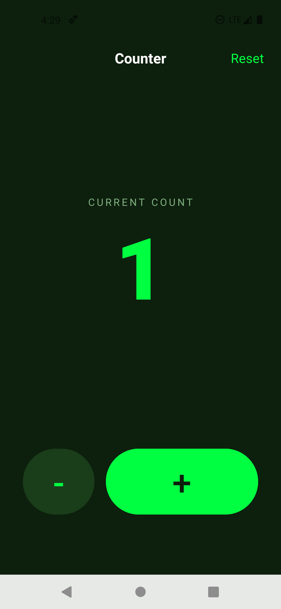

# Counter アプリ仕様書

## 概要
カウント値を増減/リセットするシンプルなカウンターアプリです。タップ操作のみで現在値を更新し、視認性の高いダーク配色で表示します。

## 画面一覧

### MainActivity（カウンター画面）
- 上部にアプリ名と Reset アクションを表示。
- 中央に "CURRENT COUNT" ラベルと現在の数値を大きく表示。
- 下部に減算（-）と加算（+）のボタンを配置。
- EdgeToEdge 対応でシステムバーの余白を調整。

## 振る舞い
- 起動時のカウントは 0。
- + ボタンで +1、- ボタンで -1。
- Reset で 0 に戻す。
- 上限/下限はなく、負数も許容。
- カウントはメモリのみで管理し、アプリ再起動や画面回転で初期化。

## 技術仕様
- パッケージ: `jp.ac.jec.cm0199.jecandroidjavatemplate`
- minSdk: 30（Android 11）
- targetSdk: 36（Android 16）
- compileSdk: 36（minorApiLevel 1）
- レイアウト: LinearLayout（縦/横の組み合わせ）
- テーマ: `Theme.Material3.DayNight.NoActionBar` をベース
- UI 配色: `background_dark` (#0D1F0D), `green_primary` (#00FF41), `green_dark` (#1A3D1A), `text_secondary` (#80B080), `white` (#FFFFFF)
- 表示要素: `txt_count` は `sans-serif-black` を使用
- 文字列: `app_name`=Counter, `current_count`=CURRENT COUNT, `reset`=Reset

## 画面イメージ
|  カウンター画面 | 
|:-----------:|
| |
